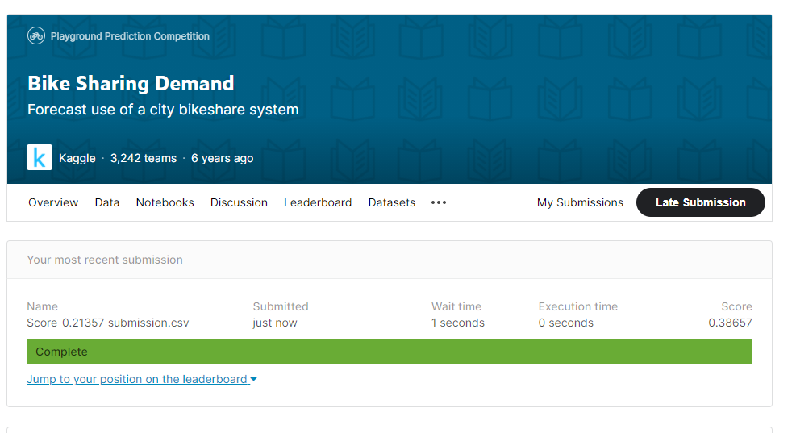

# [Boostcourse] 네이버 부스트코스

###  Kaggl_bike_sharing_Demand
     - 캐글 실습으로 배우는 데이터사이언스 구현입니다.
      - train 파일 분석
      - Prediction
      - 목표: 상위 5% 이내 점수 
     - review : https://lheon.tistory.com/70?category=904559
    

